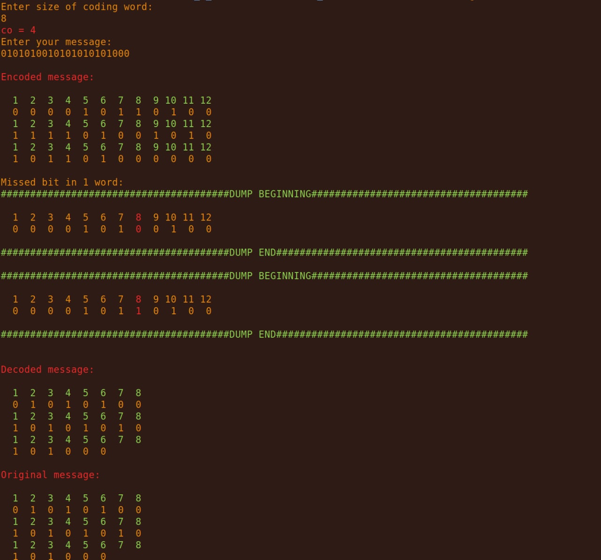

# Hemming-algorithm

First enter the size of the word to be coded

Then enter a message consisting of the characters "0" and "1". Any character other than these two is the end of the input. There is no limit to the number of characters that can be entered

If the message size is not a multiple of the word size, the missing bits of the incomplete last word will be zero filled

The encoded message is then output.

Afterwards one quasi-random bit from the message will be inverted (thus carrying out a single error) 

During decoding, the integrity of the coded lengthened words is checked and the single error is displayed, then the single error is corrected and the word where it occurred is output

The original message (saved from input time) and the decoded message are then output for data collation

Example of output:

